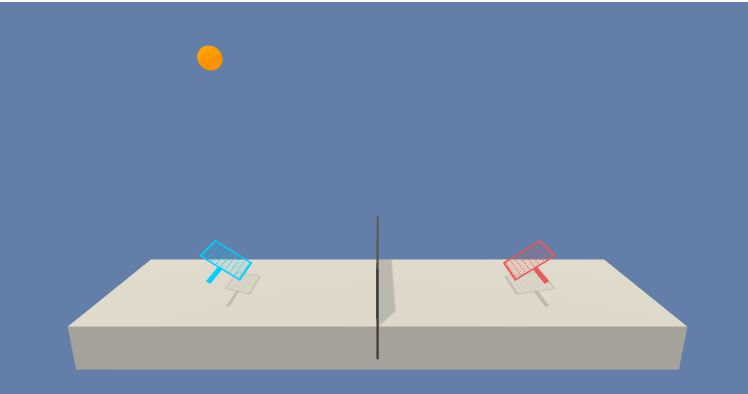

# Environment

## Goal
The goal of our agents is to keep the ball in play.

## Game Over
If an agent lets a ball hit the ground or hits the ball out of bounds

## Reward
In this environment, two agents control rackets to bounce a ball over a net. If an agent hits the ball over the net, it receives a reward of +0.1. If an agent lets a ball hit the ground or hits the ball out of bounds, it receives a reward of -0.01.

## Actions
Two continuous actions [-1, 1] are available for each agent, corresponding to movement toward (or away from) the net, and jumping.

## State
The observation space consists of 24 variables corresponding to the position and velocity of the ball and racket. Each agent receives its own, local observation.

# The Code
We will create a MADDPG -  Multi Agent Deep Deterministic Policy Gradient 
- Replay Buffer for all agents
- Noise
- 2 Agents
- For each agent we will create 4 neural networks : Actor, Critic, Actor_Target, Critic_Target

# Installation
Step 1: Activate the Environment
If you haven't already, please follow the instructions in the DRLND GitHub repository to set up your Python environment. These instructions can be found in README.md at the root of the repository. By following these instructions, you will install PyTorch, the ML-Agents toolkit, and a few more Python packages required to complete the project.

(For Windows users) The ML-Agents toolkit supports Windows 10. While it might be possible to run the ML-Agents toolkit using other versions of Windows, it has not been tested on other versions. Furthermore, the ML-Agents toolkit has not been tested on a Windows VM such as Bootcamp or Parallels.

Step 2: Download the Unity Environment
For this project, you will not need to install Unity - this is because we have already built the environment for you, and you can download it from one of the links below. You need only select the environment that matches your operating system:

Linux: click here
Mac OSX: click here https://s3-us-west-1.amazonaws.com/udacity-drlnd/P3/Tennis/Tennis_Linux.zip

Windows (32-bit): click here https://s3-us-west-1.amazonaws.com/udacity-drlnd/P3/Tennis/Tennis.app.zip

Windows (64-bit): click here https://s3-us-west-1.amazonaws.com/udacity-drlnd/P3/Tennis/Tennis_Windows_x86.zip

Then, place the file in the p3_collab-compet/ folder in the DRLND GitHub repository, and unzip (or decompress) the file.

(For Windows users) Check out this link https://support.microsoft.com/en-us/help/827218/how-to-determine-whether-a-computer-is-running-a-32-bit-version-or-64 if you need help with determining if your computer is running a 32-bit version or 64-bit version of the Windows operating system.

# How to Run the Code
- Open the file Tennis
- Run all cels
